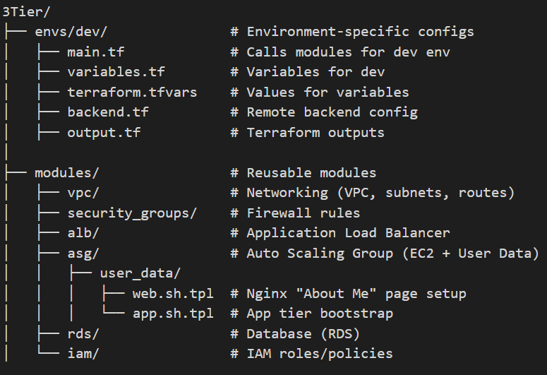

# Terraform 3-Tier AWS (Modules) — Full Project

This repository contains a modular Terraform project to deploy a 3‑Tier architecture on AWS (Web → App → DB) using modules.

**All resources are named using the pattern**: owner = `pavan`

## What is included in these project architecture
- modules/vpc
- modules/security_groups
- modules/iam
- modules/alb
- modules/asg
- modules/rds
- envs/dev —  environment that wires modules together

## Quick start
1. Unzip the project and open in VS Code.
2. Create S3 bucket + DynamoDB table for the Terraform backend (names(s3) must be unique). See `envs/dev/backend.tf` file .
3. Edit `envs/dev/terraform.tfvars` (replace your actual AMIs and DB password, and backend if you want to change name of any).
4. now run in teraminal by using path as follows :  `envs/dev/`


```bash
cd envs/dev
# Now start infrastructure building

terraform init 

# If we change any configuration & any infrastructure in Project(dev environment) run the command as below : 
terraform init -reconfigure

#Verify the design components and start planning
terraform plan

or 

terraform plan -var-file="terraform.tfvars"


# If plan looks no error then continue with next step:
terraform apply -var-file="terraform.tfvars" -auto-approve
```

## Verification needed for us here :
- ALB DNS is output after apply; open it in browser to see the web page served by web ASG.
- Use SSM Session Manager (it's preferred) to connect to instances.

## Cleanup the resources after everthing completion
From `envs/dev` run:
```
terraform destroy -var-file="terraform.tfvars" -auto-approve
```
## Important Thing and Reminder
> IMPORTANT: Do NOT commit `terraform.tfvars` with secrets to Git.
use gitignore file to avoid it to GIT.


## Documentation Steps for Project

# 🌐 3-Tier AWS Infrastructure using Terraform

This project provisions a **3-Tier architecture** on AWS using **Terraform**.  
It automatically sets up networking, security, compute resources, and a database, along with a simple **"About Me" webpage** served via Nginx.

---

## 📖 Project Overview

The infrastructure is divided into **three tiers**:

1. **Web Tier (Presentation Layer)**  
   - Auto Scaling Group of EC2 instances running **Nginx**.  
   - Displays a static **About Me page**.  
   - Instances are behind an **Application Load Balancer (ALB)**.  

2. **App Tier (Business Logic Layer)**  
   - (Placeholder for application code, bootstrapped via `app.sh.tpl`).  
   - Connects to the database tier.  

3. **Database Tier (Persistence Layer)**  
   - **Amazon RDS (MySQL/Postgres)** used as the backend database.  
   - Private, not exposed to the internet.  

---

## ⚙️ Tech Stack & Tools

- **Terraform** (Infrastructure as Code)
- **AWS VPC, Subnets, Internet Gateway, Route Tables**
- **Security Groups & IAM Roles**
- **Application Load Balancer (ALB)**
- **Auto Scaling Group (ASG) with EC2 Instances**
- **Amazon RDS** (Database)
- **Nginx Web Server**

---

## 🏗️ Architecture Diagram

[ User ] → [ Application Load Balancer (Public) ] → [ EC2 Auto Scaling Group (Web/App Tier) ] → [ Amazon RDS (Private DB) ] | [ VPC + Subnets + Security Groups ]


---

## 🚀 Setup & Deployment Steps

### Clone Repository
```bash
git clone <these-repo-url>
cd 3Tier/envs/dev

```
### Initialize Terraform
terraform init

### Validate Configuration
terraform validate

### Plan Infrastructure
terraform plan

### Deploy Infrastructure
terraform apply -auto-approve

### 📂 Project Structure


### Accessing the Application
After successful deployment, Terraform outputs the ALB DNS name

### Security Considerations

EC2 instances run in private subnets, only exposed via the ALB.

RDS is not publicly accessible (only app tier can connect).

Security Groups enforce least privilege access.

IAM roles are used for secure instance permissions.


### 👨‍💻 Author

- Pavan Kumar Kasula 
- Passionate about Cloud, Cloud Infrastructure, Automation.


